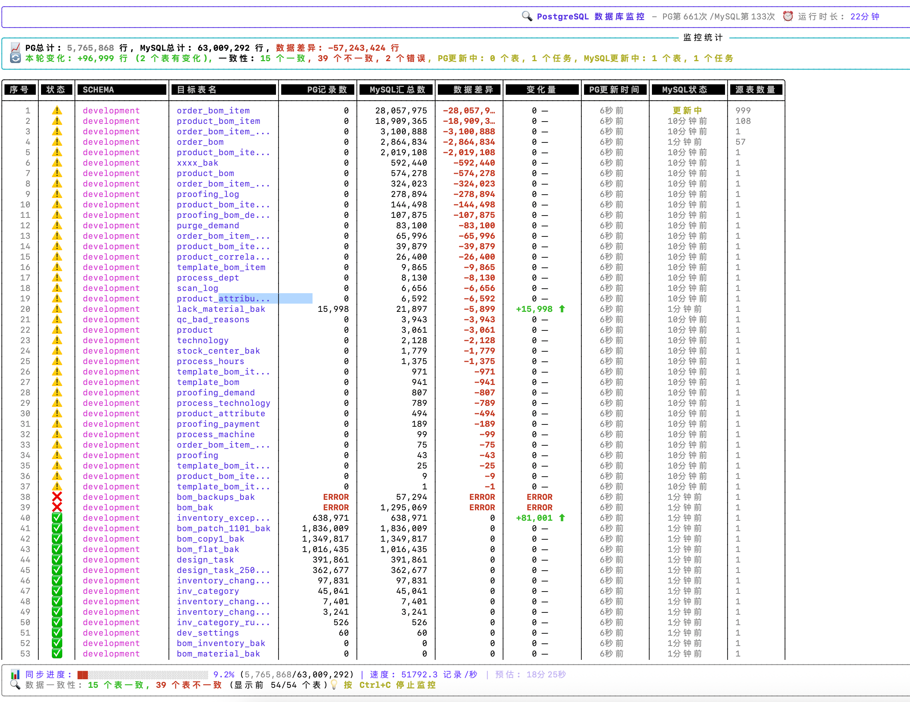

# Flink CDC 数据一致性监控工具

<div align="center">
  
  <p><em>实时CDC数据一致性监控界面</em></p>
</div>

一个功能强大的CDC（Change Data Capture）数据一致性监控工具，用于实时监控PostgreSQL与MySQL之间的数据同步状态。该工具提供直观的终端界面，帮助您快速发现和诊断数据一致性问题。

## ✨ 主要特性

### 🔍 实时监控
- **高频刷新**: 每2秒自动刷新PostgreSQL表记录数
- **并行更新**: PostgreSQL和MySQL数据并行查询，提高监控效率
- **智能估算**: 大表支持统计信息估算，避免全表扫描

### 📊 数据对比
- **一致性检测**: 实时对比PostgreSQL与MySQL数据的一致性
- **差异统计**: 精确显示数据差异和变化趋势
- **表名映射**: 智能处理表名映射规则（如：`table_uuid` → `table`）

### 🎨 丰富界面
- **美观展示**: 使用Rich库提供精美的终端用户界面
- **状态图标**: 直观的表状态指示（📈📉⚠️🔥💾📄）
- **分组统计**: 按Schema分组显示详细统计信息
- **实时更新**: Live刷新界面，无闪烁体验

### 📈 监控指标
- **记录数量**: PostgreSQL与MySQL表记录数对比
- **变化追踪**: 实时显示数据增减变化
- **一致性状态**: 数据一致性验证和异常标识
- **更新频率**: 显示最后更新时间和运行时长

## 🚀 快速开始

### 方法1: 一键启动（推荐）

```bash
./start_monitor.sh
```

该脚本会自动完成以下操作：
- ✅ 检查并安装uv包管理器
- ✅ 安装项目依赖
- ✅ 自动转换配置文件格式
- ✅ 启动监控程序

### 方法2: 手动安装

1. **安装uv包管理器**：
```bash
pip install uv
```

2. **安装项目依赖**：
```bash
uv sync
```

3. **启动监控程序**：
```bash
uv run cdc_monitor.py
```

## ⚙️ 配置说明

### 自动配置
程序会自动检测并转换`../src/main/resources/application.properties`文件为`config.ini`格式。

### 手动配置
创建或编辑`config.ini`文件：

```ini
[mysql]
host = localhost
port = 3306
databases = development,mrp,chatnio,chat,bboss
username = root
password = your_password
ignored_table_prefixes = __spliting_,__temp_,__backup_

[postgresql]
host = localhost
port = 5432
database = postgres
username = postgres
password = your_password

[monitor]
refresh_interval = 2
max_tables_display = 100
enable_clear_screen = true
mysql_update_interval = 5
```

### 配置参数说明

| 参数 | 说明 | 默认值 |
|------|------|---------|
| `refresh_interval` | PostgreSQL数据刷新间隔（秒） | 2 |
| `mysql_update_interval` | MySQL数据更新间隔（秒） | 5 |
| `max_tables_display` | 最大显示表数量 | 100 |
| `enable_clear_screen` | 是否清屏刷新 | true |
| `ignored_table_prefixes` | 忽略的表前缀（逗号分隔） | - |

## 📊 界面说明

### 监控面板组成

1. **标题栏**: 显示工具名称、刷新次数和运行状态
2. **统计概览**: 总表数量、一致性统计、数据差异汇总
3. **Schema分组**: 按数据库Schema分组的详细统计
4. **数据表格**: 各表的详细监控信息
5. **状态说明**: 图标含义和操作提示

### 表格列说明

| 列名 | 说明 |
|------|------|
| **序号** | 表序号（附带状态图标） |
| **状态** | 表状态指示 |
| **SCHEMA** | 数据库Schema名称 |
| **目标表名** | PostgreSQL中的表名 |
| **PG记录数** | PostgreSQL表记录数 |
| **MySQL汇总数** | MySQL对应表的汇总记录数 |
| **数据差异** | PG与MySQL的记录数差异 |
| **变化量** | 本次刷新的记录数变化 |
| **PG更新时间** | PostgreSQL数据最后更新时间 |
| **MySQL状态** | MySQL数据同步状态 |
| **源表数量** | MySQL源表数量 |

### 状态图标含义

| 图标 | 含义 | 说明 |
|------|------|------|
| 📈 | 数据增长 | PostgreSQL记录数增加 |
| 📉 | 数据减少 | PostgreSQL记录数减少 |
| ⚠️ | 数据不一致 | PG与MySQL数据不匹配 |
| 🔥 | 大表 | 记录数超过100万 |
| 💾 | 中等表 | 记录数10万-100万 |
| 📄 | 小表 | 记录数少于10万 |
| ✅ | 数据一致 | PG与MySQL数据匹配 |

## 🔧 表名映射规则

程序支持智能表名映射，将MySQL的多个源表映射到PostgreSQL的目标表：

| MySQL表名格式 | PostgreSQL目标表 | 说明 |
|--------------|-----------------|------|
| `table_runtime` | `table` | 移除runtime后缀 |
| `table_123456789` | `table` | 移除9位数字后缀 |
| `table_uuid_format` | `table` | 移除UUID格式后缀 |
| `table_123456789_2024` | `table` | 移除数字_年份后缀 |

## 📋 系统要求

- **Python版本**: 3.8+
- **依赖包**:
  - `rich >= 13.0.0` - 终端界面库
  - `psycopg2-binary >= 2.9.0` - PostgreSQL连接器
  - `PyMySQL >= 1.0.0` - MySQL连接器
  - `configparser >= 5.0.0` - 配置文件解析

## 🎯 使用场景

- **CDC数据同步监控**: 实时监控Flink CDC同步任务的数据一致性
- **数据质量检测**: 发现和诊断数据同步过程中的异常
- **运维监控**: 持续监控生产环境的数据同步状态
- **故障排查**: 快速定位数据不一致的表和原因

## ⌨️ 快捷键

| 快捷键 | 功能 |
|--------|------|
| `Ctrl+C` | 停止监控程序 |
| `Ctrl+Z` | 暂停程序（可用fg恢复） |

## 🔍 故障排除

### 数据库连接问题
```bash
# 检查网络连接
ping your_database_host

# 测试端口连通性
telnet your_database_host 5432

# 检查数据库服务状态
systemctl status postgresql
systemctl status mysql
```

### 权限问题
确保数据库用户具有以下权限：
- PostgreSQL: `SELECT` 权限（系统表和用户表）
- MySQL: `SELECT` 权限（`INFORMATION_SCHEMA`和用户数据库）

### 性能优化
- 对于大表，程序会自动使用统计信息估算记录数
- 可以通过`ignored_table_prefixes`配置忽略不需要监控的表
- 调整`refresh_interval`和`mysql_update_interval`平衡实时性和性能

### 常见错误及解决方案

| 错误信息 | 可能原因 | 解决方案 |
|----------|----------|----------|
| Connection refused | 数据库服务未启动 | 启动数据库服务 |
| Authentication failed | 用户名或密码错误 | 检查配置文件中的认证信息 |
| Permission denied | 权限不足 | 授予用户必要的查询权限 |
| Table not found | 表不存在 | 检查表名和Schema配置 |

## 📁 项目结构

```
flink-cdc-monitor/
├── cdc_monitor.py         # 主监控程序
├── config.ini            # 配置文件
├── start_monitor.sh       # 启动脚本
├── pyproject.toml         # 项目配置
├── uv.lock               # 依赖锁定文件
├── images/               # 截图资源
│   └── monitor-interface.png
└── README.md             # 项目说明
```

## 🤝 贡献指南

欢迎提交Issue和Pull Request来改进这个项目！

1. Fork 本仓库
2. 创建你的特性分支 (`git checkout -b feature/AmazingFeature`)
3. 提交你的更改 (`git commit -m 'Add some AmazingFeature'`)
4. 推送到分支 (`git push origin feature/AmazingFeature`)
5. 打开一个Pull Request

## 📄 许可证

本项目基于MIT许可证开源 - 查看 [LICENSE](LICENSE) 文件了解详情。

## 📞 技术支持

如果你在使用过程中遇到问题，请：

1. 查看本文档的故障排除部分
2. 搜索已有的[Issues](../../issues)
3. 创建新的Issue并提供详细信息

---

<div align="center">
  <p>⭐ 如果这个项目对你有帮助，请给个星标支持一下！</p>
</div> 